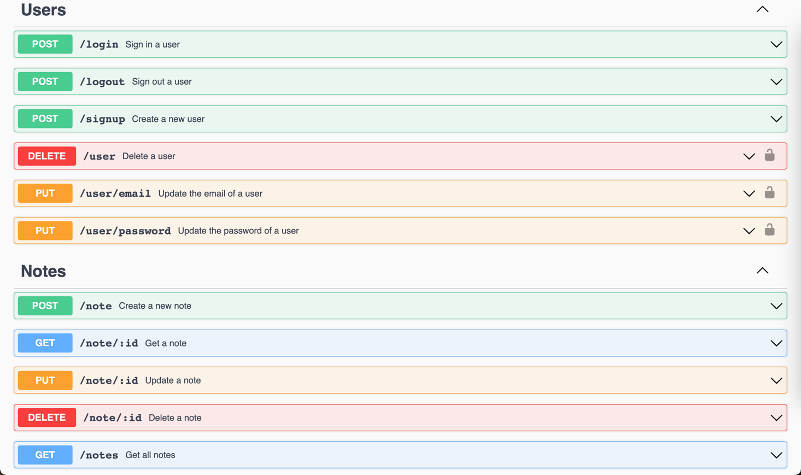
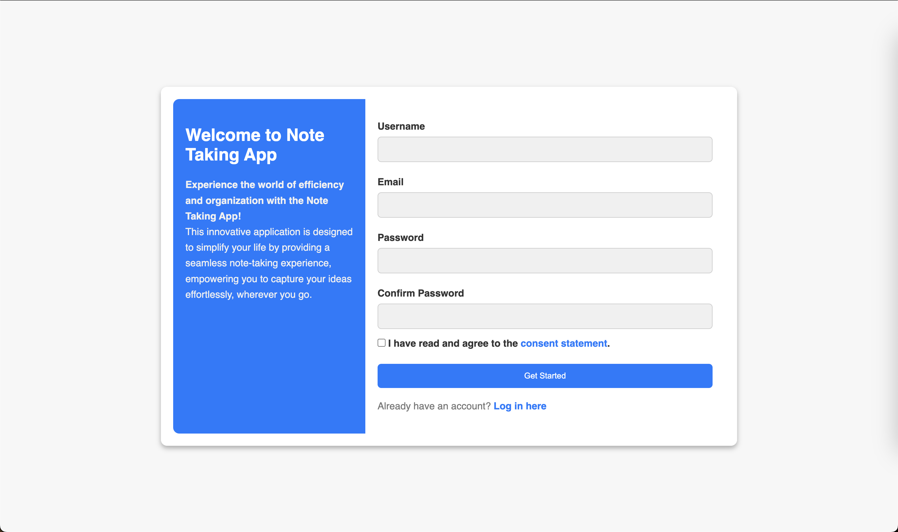
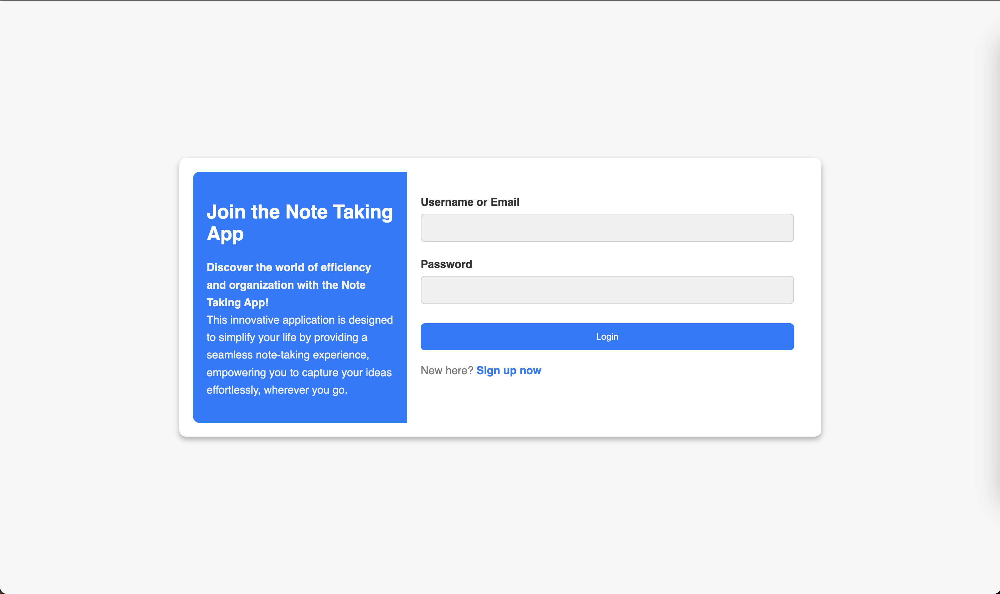

# go-user-notes-app
User auth and taking notes app with Golang, Fiber framework and Postgres as database.


**Docker command to run postgresql container:**
```bash
$ docker run -it -d -p 5432:5432 --name notes-postgre -e POSTGRES_PASSWORD=notes-pass -d postgres:latest
```

**Swagger UI:**
```http request
http://localhost:8080/swagger/index.html
```



**Screenshots of the app:**


* **Sign up page:**


* **Login page:**
